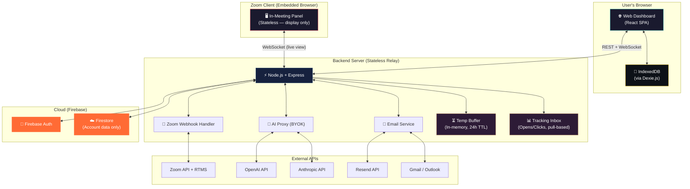
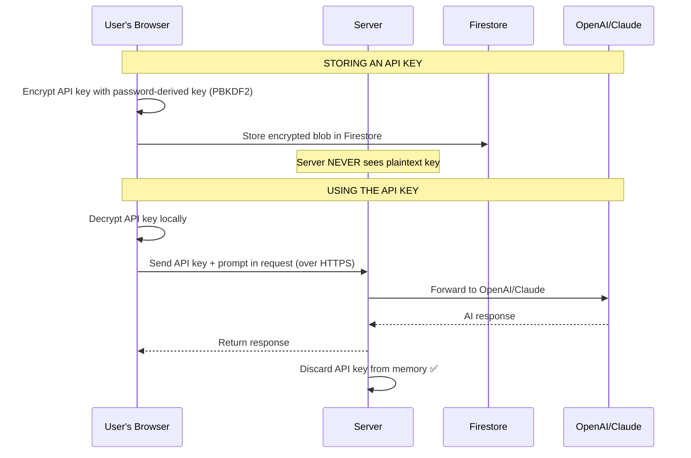
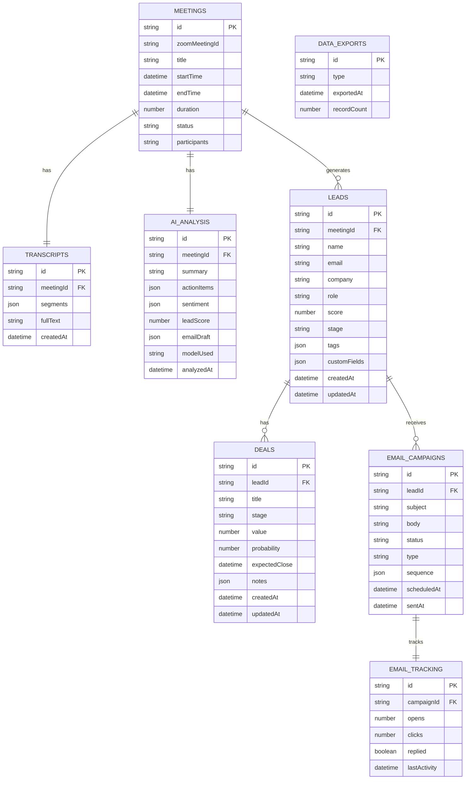

# 🔥 Project Blueprint v2: DealForge — Meeting Intelligence SaaS

> **Zoom Marketplace App** · Real-time meeting intelligence · Lead management · Automated email outreach

> [!IMPORTANT]
> **v2 — Revised after architectural review.** This version fixes 5 critical issues found in v1. Changes are marked with 🔧 throughout.

---

## 📋 Table of Contents

- [Product Vision](#product-vision)
- [Architecture Overview](#architecture-overview)
- [Tech Stack](#tech-stack)
- [Data Strategy](#data-strategy)
- [Feature Breakdown](#feature-breakdown)
- [Project Structure](#project-structure)
- [Design System](#design-system)
- [Build Phases](#build-phases)
- [Risks & Mitigations](#risks--mitigations)

---

## Product Vision

**Product Name:** DealForge 🔥

**One-liner:** An AI-powered Zoom App that turns every sales meeting into actionable leads, follow-ups, and closed deals — automatically.

**Problem:** Sales teams lose deals because of poor post-meeting follow-up. Notes get lost, action items are forgotten, and leads go cold.

**Solution:** A Zoom Marketplace app with two surfaces:

| Surface | Where | Purpose |
|---------|-------|---------|
| **In-Meeting Panel** | Inside Zoom (iframe) | Real-time transcription, live AI suggestions, quick notes |
| **Web Dashboard** | Browser (separate tab) | CRM pipeline, email campaigns, analytics, lead management, settings |

**Target User:** Mid-market B2B SaaS sales teams (10–500 employees)

**Business Model:** Monthly subscription (tiered pricing)

**AI Approach:** BYOK (Bring Your Own Key) — users provide their own OpenAI or Anthropic API keys

---

## Architecture Overview

### 🔧 Critical Fix #1: The Two-Browser Problem

> [!CAUTION]
> **Problem found in v1:** The Zoom in-meeting panel runs inside Zoom's embedded Chromium browser. The web dashboard runs in the user's regular browser (Chrome, Firefox, etc.). These are **completely separate browser contexts** — they **cannot share IndexedDB**. The v1 blueprint assumed they could.

**Solution:** The Zoom panel is a **lightweight, stateless view**. It displays real-time data but stores nothing locally. All data flows through the backend server as a relay, and only the **Web Dashboard** (the user's main browser) stores data in IndexedDB.



### How Data Flows (Privacy-First) — Corrected

```mermaid
sequenceDiagram
    participant ZP as Zoom Panel<br/>(in Zoom)
    participant S as Backend Server
    participant WD as Web Dashboard<br/>(in Browser)
    participant L as IndexedDB<br/>(Local)
    participant F as Firebase

    Note over ZP,F: 🎙️ DURING A MEETING

    rect rgb(30, 30, 45)
        Note right of ZP: Scenario A: Dashboard is OPEN
        ZP->>S: Audio stream / transcription events
        S->>S: Process transcription
        S->>ZP: Live transcript (display only)
        S->>WD: Push via WebSocket
        WD->>L: Store transcript locally
        S->>S: Discard from memory ✅
    end

    rect rgb(45, 30, 30)
        Note right of ZP: Scenario B: Dashboard is CLOSED
        ZP->>S: Audio stream / transcription events
        S->>S: Process transcription
        S->>ZP: Live transcript (display only)
        S->>S: Buffer in memory (24h TTL) ⏳
        Note over S: Data held temporarily until<br/>dashboard connects & pulls it
    end

    Note over ZP,F: 📝 AFTER THE MEETING

    WD->>S: Pull any buffered meeting data
    S-->>WD: Return buffered data
    WD->>L: Store in IndexedDB
    S->>S: Clear buffer ✅

    WD->>S: Request AI analysis (with user's API key)
    S->>S: Call OpenAI / Claude
    S-->>WD: Return summary, action items, sentiment, lead score
    WD->>L: Store analysis locally
    WD->>L: Auto-create lead card

    Note over ZP,F: 📧 EMAIL TRACKING (Pull-Based)

    Note over S: Tracking pixel/link hit arrives at server
    S->>S: Store in Tracking Inbox (minimal metadata)
    WD->>S: Periodic pull — "any new tracking events?"
    S-->>WD: Return events
    WD->>L: Store tracking data locally
    S->>S: Clear from inbox ✅

    Note over ZP,F: ☁️ ACCOUNT DATA ONLY
    WD->>F: Auth tokens, user profile, subscription, settings
```



> [!IMPORTANT]
> **Privacy guarantee (updated):** Sensitive data (transcripts, leads, emails, analytics) is **never permanently stored on the server**. The server uses a temporary in-memory buffer (24h TTL) only when the dashboard is offline. Once the dashboard pulls the data, the server discards it.

> [!WARNING]
> **Trade-offs to understand:**
> - Users **cannot access data from a different device/browser** — this is the intentional privacy trade-off
> - If the user doesn't open the dashboard within **24 hours** of a meeting, buffered data is lost (we'll show warnings)
> - Browser data can be cleared by the user or browser cleanup tools — **regular data export/backup is essential**

---

## 🔧 Critical Fix #2: Real-Time Transcription Approach

The original blueprint was vague about HOW we get real-time transcription. There are 3 possible approaches:

| Approach | How It Works | Complexity | Quality |
|----------|-------------|:----------:|:-------:|
| **A. Zoom's Built-in Captions** | Use Zoom's native transcription, capture via SDK events | 🟢 Low | 🟡 Medium |
| **B. Zoom RTMS (Real-Time Media Streams)** | Receive raw audio from Zoom, transcribe with Whisper/Deepgram | 🟡 Medium | 🟢 High |
| **C. Browser Audio Capture** | Capture system audio via browser API, send to speech-to-text | 🔴 High | 🟡 Medium |

### Recommended: Approach A for MVP, migrate to B later

**MVP (Phase 1):** Use **Zoom's built-in closed captions / live transcription** feature. The Zoom Apps SDK provides access to meeting context and transcription events. This is the fastest path to a working product.

**Post-MVP:** Upgrade to **Zoom RTMS** for higher quality, speaker diarization, and custom vocabulary. RTMS gives us raw audio streams that we can process with Whisper or Deepgram for superior accuracy.

---

## Tech Stack

Since you're coming from a non-technical background, here's what each piece does and why we chose it:

### Frontend (What the User Sees)

| Technology | What It Does | Why This One |
|-----------|-------------|--------------|
| **React 18** | Builds the UI (buttons, pages, panels) | Industry standard, huge community, Zoom SDK supports it |
| **Vite** | Development tooling (fast builds, hot reload) | Fastest dev experience, modern standard |
| **React Router** | Navigation between pages | Simple, works great with SPAs |
| **Dexie.js** | Local database in the browser (IndexedDB wrapper) | Makes IndexedDB easy to use, supports queries |
| **Zustand** | State management (sharing data between components) | Tiny, simple, no boilerplate — perfect for vibe coding |
| **Vanilla CSS** | Styling | Full control, no dependencies |
| **Lucide React** | Icons | Beautiful, consistent icon set |
| **Recharts** | Charts and analytics | Easy React-based charting |

### Backend (The Engine Behind the Scenes)

| Technology | What It Does | Why This One |
|-----------|-------------|--------------|
| **Node.js + Express** | Server that handles API calls, webhooks, AI requests | Simple, JavaScript everywhere |
| **Zoom Apps SDK** | Connects to Zoom's platform | Required for Zoom Marketplace apps |
| **Firebase Admin SDK** | Server-side Firebase auth verification | Secure token verification |
| **OpenAI SDK** | Calls GPT models for AI features | BYOK — uses user's key |
| **Anthropic SDK** | Calls Claude models for AI features | BYOK — uses user's key |
| **Resend SDK** | Sends emails programmatically | Modern email API, great DX |
| **Socket.io** | Real-time communication (WebSocket) | Pushes live data to dashboard |

### Infrastructure

| Technology | What It Does | Why This One |
|-----------|-------------|--------------|
| **Firebase Auth** | User login/signup (Google, email/password) | Easy setup, handles OAuth |
| **Firebase Firestore** | Cloud database (account data only) | Only stores non-sensitive data |
| **ngrok** | HTTPS tunnel for local development | Required by Zoom Apps SDK |
| **Railway** | Hosting the backend + frontend | Easy deployment, supports WebSockets well |

---

## Data Strategy

### What Goes WHERE

| Data Type | Storage Location | Reason |
|-----------|-----------------|--------|
| User auth (login credentials) | ☁️ Firebase Auth | Needs to work across devices |
| User profile (name, email, plan) | ☁️ Firestore | Account-level, non-sensitive |
| Subscription & billing info | ☁️ Firestore | Needs server-side access |
| API keys (OpenAI/Claude) | 🔧 ☁️ Firestore (client-side encrypted) | See Fix #3 below |
| App settings & preferences | ☁️ Firestore | Small, non-sensitive |
| Meeting transcripts | 💾 IndexedDB (Local) | **Sensitive** — stays on user's machine |
| AI summaries & action items | 💾 IndexedDB (Local) | **Sensitive** — derived from meetings |
| Lead/contact data | 💾 IndexedDB (Local) | **Sensitive** — customer PII |
| Deal pipeline & stages | 💾 IndexedDB (Local) | **Sensitive** — business data |
| Email drafts & campaigns | 💾 IndexedDB (Local) | **Sensitive** — outreach content |
| Email tracking data | 🔧 ⏳ Server → 💾 Local | See Fix #4 below |
| Sentiment analysis results | 💾 IndexedDB (Local) | **Sensitive** — meeting insights |

### 🔧 Critical Fix #3: BYOK API Key Security

> [!WARNING]
> **Problem in v1:** API keys were stored "encrypted" in Firestore, but if the server holds the encryption key, it's not truly secure — a server breach exposes all keys.

**Solution: Client-side encryption**



The API key travels over HTTPS per-request and is never stored on the server. The encrypted blob in Firestore can only be decrypted by the user's browser.

### 🔧 Critical Fix #4: Email Tracking Needs Server Persistence

> [!NOTE]
> **Problem in v1:** Email open/click tracking works by embedding a tiny tracking pixel (for opens) and redirect links (for clicks) in emails. When a recipient opens the email or clicks a link, a request hits YOUR server. But your server is supposed to be stateless — contradiction!

**Solution: Tracking Inbox pattern**

The server maintains a minimal **Tracking Inbox** — a lightweight queue that stores only:
- `{ campaignId, event: "open"|"click", timestamp }`

No email content, no personal data — just event metadata. When the user opens their dashboard, it pulls events from the inbox and stores them in local IndexedDB. The server then deletes the pulled events.

This is an honest, small compromise to the "nothing on server" rule, but the data is minimal and ephemeral.

### IndexedDB Schema (Local Database)



### 🔧 Critical Fix #5: Data Durability

> [!CAUTION]
> **Problem in v1:** IndexedDB data can be lost if the user clears browser data, reinstalls the browser, or the browser evicts storage under disk pressure. For a business tool managing sales pipeline data, this is a **critical risk**.

**Mitigations (built into MVP):**
1. **Automatic JSON backup exports** — Scheduled weekly auto-export to a local JSON file (user chooses folder)
2. **Manual export** — One-click export of all data (JSON + CSV formats) from Settings
3. **Import/restore** — Ability to import a backup file to restore data
4. **Storage persistence request** — Use `navigator.storage.persist()` to ask the browser not to evict our data
5. **Low storage warnings** — Alert users when IndexedDB usage exceeds 80% of quota

---

## Feature Breakdown

### 🎙️ In-Meeting Panel (Inside Zoom)

> 🔧 **Updated:** Panel is now stateless — it displays data streamed from the server but stores nothing locally (because it can't share IndexedDB with the dashboard).

| Feature | Description | AI Powered | Storage |
|---------|-------------|:----------:|:-------:|
| Live Transcription | Real-time speech-to-text during the call | ✅ | Server relay → Dashboard |
| Speaker Identification | Labels who said what | — | Server relay → Dashboard |
| Live Suggestions | AI suggests talking points, responses | ✅ | Display only (ephemeral) |
| Quick Notes | Manual note-taking alongside transcript | — | Sent to server → Dashboard |
| Meeting Timer | Shows elapsed time and key moments | — | Display only |
| Action Item Detection | Flags action items as they come up | ✅ | Server relay → Dashboard |

### 📊 Web Dashboard

#### Meeting Intelligence
| Feature | Description | AI Powered |
|---------|-------------|:----------:|
| Meeting History | Browse past meetings with search & filter | — |
| AI Summary | Auto-generated executive summary | ✅ |
| Action Items | Extracted action items with assignees & deadlines | ✅ |
| Sentiment Analysis | Meeting mood timeline (positive/negative/neutral) | ✅ |
| Key Moments | Highlighted important parts of the conversation | ✅ |
| Full Transcript | Searchable, timestamped transcript | — |

#### Lead Management
| Feature | Description | AI Powered |
|---------|-------------|:----------:|
| Lead Cards | Contact info, company, role, meeting history | — |
| Lead Scoring | AI scores leads based on meeting engagement | ✅ |
| Auto-Creation | Leads auto-created from meeting participants | ✅ |
| Tags & Filters | Organize leads by custom tags | — |
| Activity Timeline | Full history of interactions per lead | — |

#### Deal Pipeline
| Feature | Description | AI Powered |
|---------|-------------|:----------:|
| Kanban Board | Visual drag-and-drop pipeline | — |
| Deal Stages | Customizable stages (Discovery → Closed Won) | — |
| Deal Value | Track expected revenue | — |
| Win Probability | AI-estimated close probability | ✅ |
| Notes & History | Attach notes and meeting references | — |

#### Email Outreach
| Feature | Description | AI Powered |
|---------|-------------|:----------:|
| AI Draft Generation | Generate follow-up emails from meeting context | ✅ |
| Email Editor | Rich text editor for reviewing/editing drafts | — |
| Send via Resend | Send emails through Resend API | — |
| Gmail/Outlook Integration | Send from user's own email account | — |
| Drip Campaigns | Multi-step automated email sequences | — |
| Open/Click Tracking | Track email engagement (via Tracking Inbox) | — |

#### Settings & Configuration
| Feature | Description |
|---------|-------------|
| API Key Management | Add/update OpenAI and Anthropic keys (client-side encrypted) |
| AI Model Selection | Choose which model to use (GPT-4o, Claude Sonnet, etc.) |
| Email Account Connection | Connect Gmail/Outlook |
| Pipeline Customization | Custom deal stages |
| Subscription Management | View plan, billing, upgrade |
| 🔧 Data Export / Backup | Export all local data as JSON/CSV, import backups |
| 🔧 Storage Health | Monitor IndexedDB usage, storage warnings |

---

## Project Structure

```
dealforge/
├── client/                          # Frontend (React + Vite)
│   ├── public/
│   │   └── assets/                  # Static assets, logos, favicon
│   ├── src/
│   │   ├── main.jsx                 # App entry point
│   │   ├── App.jsx                  # Root component + routing
│   │   ├── index.css                # Global styles + design tokens
│   │   │
│   │   ├── components/              # Reusable UI components
│   │   │   ├── common/              # Button, Input, Modal, Card, Badge, Tooltip
│   │   │   ├── layout/              # Sidebar, Header, PageLayout, ZoomPanelLayout
│   │   │   └── charts/              # SentimentChart, PipelineChart, EmailMetrics
│   │   │
│   │   ├── pages/                   # Page-level components
│   │   │   ├── zoom-panel/          # In-meeting panel views (STATELESS)
│   │   │   │   ├── TranscriptionView.jsx
│   │   │   │   ├── SuggestionsView.jsx
│   │   │   │   └── NotesView.jsx
│   │   │   ├── dashboard/           # Web dashboard pages
│   │   │   │   ├── MeetingsPage.jsx
│   │   │   │   ├── MeetingDetailPage.jsx
│   │   │   │   ├── LeadsPage.jsx
│   │   │   │   ├── PipelinePage.jsx
│   │   │   │   ├── EmailPage.jsx
│   │   │   │   ├── AnalyticsPage.jsx
│   │   │   │   └── SettingsPage.jsx
│   │   │   ├── auth/                # Login, Signup, Onboarding
│   │   │   └── landing/             # Marketing / landing page
│   │   │
│   │   ├── services/                # Business logic & data layer
│   │   │   ├── local-db/            # Dexie.js IndexedDB setup
│   │   │   │   ├── db.js            # Database schema & initialization
│   │   │   │   ├── meetings.js      # Meeting CRUD operations
│   │   │   │   ├── leads.js         # Lead CRUD operations
│   │   │   │   ├── deals.js         # Deal CRUD operations
│   │   │   │   ├── emails.js        # Email CRUD operations
│   │   │   │   └── backup.js        # 🔧 Export / import / auto-backup
│   │   │   ├── firebase/            # Firebase config & helpers
│   │   │   │   ├── config.js        # Firebase initialization
│   │   │   │   └── auth.js          # Auth helpers
│   │   │   ├── ai/                  # AI service layer
│   │   │   │   └── ai-service.js    # Calls backend AI proxy
│   │   │   ├── zoom/                # Zoom SDK integration
│   │   │   │   └── zoom-sdk.js      # Zoom Apps SDK helpers
│   │   │   ├── crypto/              # 🔧 Client-side encryption
│   │   │   │   └── key-vault.js     # PBKDF2 encrypt/decrypt for API keys
│   │   │   └── api/                 # Backend API client
│   │   │       └── client.js        # Axios/fetch wrapper
│   │   │
│   │   ├── hooks/                   # Custom React hooks
│   │   │   ├── useLocalDB.js        # Hook for IndexedDB operations
│   │   │   ├── useWebSocket.js      # Hook for real-time data
│   │   │   └── useStorageHealth.js  # 🔧 Monitor IndexedDB quota
│   │   ├── store/                   # Zustand stores
│   │   │   ├── authStore.js
│   │   │   ├── meetingStore.js
│   │   │   └── uiStore.js
│   │   └── utils/                   # Helper functions
│   │
│   ├── vite.config.js
│   └── package.json
│
├── server/                          # Backend (Node.js + Express)
│   ├── src/
│   │   ├── index.js                 # Server entry point
│   │   ├── routes/
│   │   │   ├── auth.js              # Auth routes
│   │   │   ├── zoom.js              # Zoom OAuth + webhooks
│   │   │   ├── ai.js                # AI proxy routes
│   │   │   ├── email.js             # Email sending routes
│   │   │   └── tracking.js          # 🔧 Email tracking inbox routes
│   │   ├── services/
│   │   │   ├── zoom-service.js      # Zoom API interactions
│   │   │   ├── ai-service.js        # OpenAI + Anthropic calls
│   │   │   ├── email-service.js     # Resend + Gmail/Outlook
│   │   │   ├── firebase-admin.js    # Firebase Admin setup
│   │   │   └── buffer-service.js    # 🔧 Temp meeting data buffer (24h TTL)
│   │   ├── middleware/
│   │   │   ├── auth.js              # JWT verification
│   │   │   └── rateLimit.js         # Rate limiting
│   │   └── utils/
│   │       └── encryption.js        # Server-side utilities
│   │
│   ├── package.json
│   └── .env.example
│
├── .gitignore
├── README.md
└── package.json                     # Root package.json (workspace)
```

---

## Design System

### Visual Identity — *"Claude meets Linear"*

**Vibe:** Dark, sleek, clean, minimal, futuristic — inspired by Claude's warm intelligence and Linear's precision.

### Color Palette

| Token | Value | Usage |
|-------|-------|-------|
| `--bg-primary` | `#0d0d0d` | Main background |
| `--bg-secondary` | `#1a1a1a` | Cards, panels |
| `--bg-tertiary` | `#252525` | Hover states, elevated surfaces |
| `--bg-glass` | `rgba(255,255,255,0.04)` | Glassmorphism panels |
| `--text-primary` | `#f5f0e8` | Primary text (warm off-white, Claude-like) |
| `--text-secondary` | `#a39e93` | Secondary text |
| `--text-muted` | `#6b6560` | Muted/disabled text |
| `--accent-primary` | `#d4a574` | Primary accent (warm amber, Claude-inspired) |
| `--accent-hover` | `#e0b88a` | Accent hover state |
| `--accent-glow` | `rgba(212,165,116,0.15)` | Glow effects |
| `--success` | `#4ecdc4` | Positive sentiment, won deals |
| `--warning` | `#f0c929` | Caution, pending items |
| `--danger` | `#e94560` | Negative sentiment, alerts |
| `--border` | `rgba(255,255,255,0.08)` | Subtle borders |

### Typography

| Element | Font | Size | Weight |
|---------|------|------|--------|
| Headings | **Inter** | 24–32px | 600 |
| Body | **Inter** | 14–16px | 400 |
| Code/Data | **JetBrains Mono** | 13px | 400 |
| Labels | **Inter** | 12px | 500 |

### Design Principles

- **Glassmorphism:** Subtle frosted glass effects on cards and panels using `backdrop-filter: blur()`
- **Micro-animations:** Smooth 200–300ms transitions on hover, focus, and state changes
- **Depth:** Layered surfaces with subtle shadows and border opacity changes
- **Warm Accents:** Claude-inspired warm amber tones against cool dark backgrounds
- **Whitespace:** Generous padding and margins for a premium, breathable feel
- **Consistent Radius:** 8px for small elements, 12px for cards, 16px for modals

---

## Build Phases

### Phase 1 — Foundation & Meeting Intelligence (Weeks 1–4)

> **Goal:** A working Zoom App that can transcribe meetings and show AI summaries on the dashboard.

| Week | Tasks |
|------|-------|
| **1** | Project scaffolding (React + Vite + Express monorepo), design system (CSS tokens, base components), Firebase Auth (login/signup/onboarding) |
| **2** | Web Dashboard shell (sidebar, header, routing, empty pages), Zoom Developer App registration, OAuth flow, ngrok HTTPS setup |
| **3** | Zoom in-meeting panel (stateless UI), meeting transcription (Zoom captions API → server relay → WebSocket → IndexedDB), transcript viewer page |
| **4** | BYOK setup (client-side encrypted key storage), AI proxy (server), post-meeting analysis (summary, action items, sentiment), meeting detail page |

**Deliverable:** User installs the Zoom App → joins a meeting → sees live transcription in the panel → opens dashboard → views AI-generated summary, action items, and sentiment analysis.

---

### Phase 2 — Lead Management & Pipeline (Weeks 5–8)

> **Goal:** Auto-create leads from meetings and manage deals in a visual pipeline.

| Week | Tasks |
|------|-------|
| **5** | Lead management UI (list view, lead cards, search & filter), lead CRUD in IndexedDB |
| **6** | Auto lead creation from meeting participants, AI lead scoring, lead detail page |
| **7** | Deal pipeline (Kanban board with drag-and-drop), customizable deal stages, deal CRUD |
| **8** | Activity timelines, lead ↔ meeting linking, deal notes, data export/backup (v1) |

**Deliverable:** After a meeting, leads auto-appear with AI scores. Sales reps manage deals in a drag-and-drop Kanban pipeline. Data can be exported as backup.

---

### Phase 3 — Email Outreach (Weeks 9–12)

> **Goal:** AI-generated follow-up emails with campaign management.

| Week | Tasks |
|------|-------|
| **9** | AI email draft generation (from meeting transcript + lead context), rich text email editor |
| **10** | Resend API integration, send emails from dashboard, email history per lead |
| **11** | Gmail/Outlook OAuth integration, send from user's own email account |
| **12** | Drip campaigns (multi-step automated sequences), email scheduling |

**Deliverable:** After a meeting, AI drafts a follow-up email using the transcript. Users edit, send, and create automated email sequences.

---

### Phase 4 — Analytics, Tracking & Launch (Weeks 13–16)

> **Goal:** Email tracking, analytics dashboard, billing, and Zoom Marketplace submission.

| Week | Tasks |
|------|-------|
| **13** | Email tracking (open/click via Tracking Inbox), tracking pixel + redirect links, engagement dashboard |
| **14** | Analytics page (meeting frequency, pipeline velocity, email performance, lead score trends) |
| **15** | Subscription/billing (Stripe Checkout integration), plan tiers, settings polish |
| **16** | End-to-end testing, bug fixes, Zoom Marketplace submission process, landing page |

**Deliverable:** Full DealForge product with analytics, email tracking, billing, and a polished landing page. Submitted to Zoom Marketplace for review.

---

## 🎯 What We Build FIRST (MVP Scope)

For the very first buildable version, we focus on **Phase 1 only**:

1. ✅ Project scaffolding + design system (CSS tokens, base components)
2. ✅ Firebase Auth (login / signup / Google OAuth)
3. ✅ Web Dashboard shell (sidebar navigation, page routing, responsive layout)
4. ✅ Zoom App registration + OAuth flow
5. ✅ In-meeting panel (stateless live transcription view)
6. ✅ Meeting transcription pipeline (Zoom → Server → Dashboard → IndexedDB)
7. ✅ BYOK API key setup (client-side encrypted)
8. ✅ AI summary generation (post-meeting analysis)
9. ✅ Storage persistence + basic data export

---

## Risks & Mitigations

| Risk | Impact | Mitigation |
|------|--------|------------|
| **Zoom Marketplace rejection** | Can't distribute the app | Study Zoom's review requirements early; follow their security & privacy guidelines strictly |
| **Zoom RTMS complexity** | Real-time audio processing is hard | Start with Zoom's built-in captions API (simpler); upgrade to RTMS post-MVP |
| **IndexedDB data loss** | Users lose their sales pipeline | Auto-backup to JSON weekly; manual export; `navigator.storage.persist()`; prominent warnings |
| **BYOK key exposure** | Security breach | Client-side PBKDF2 encryption; keys only transit over HTTPS per-request; never stored on server |
| **24h buffer expiry** | Meeting data lost if dashboard isn't opened | Push notifications (email/browser) reminding users to sync; extend TTL if needed |
| **Browser storage limits** | IndexedDB quota exceeded | Monitor usage; warn at 80%; offer cleanup of old meetings; data export before cleanup |
| **WebSocket reliability** | Dropped connections during meetings | Auto-reconnect logic; fallback to HTTP polling; server-side buffering catches gaps |

---

> [!TIP]
> **For a non-technical founder:** You don't need to understand every piece of the tech stack. Think of it like building a house — I'll handle the plumbing and wiring, you focus on what rooms you want and how they should look. Just tell me when something doesn't feel right!

---

**Review the fixes above. When you're happy with the plan, hit "Proceed" and we'll start scaffolding DealForge! 🔥**


# DealForge - Remaining Tasks

## Completed

### Phase 1: MVP & Meeting Intelligence
- [x] Project scaffolding (monorepo, workspaces, build config)
- [x] Design system (CSS tokens, glassmorphism, dark theme)
- [x] Firebase Auth (login/signup/Google OAuth)
- [x] Web Dashboard shell (sidebar, header, routing)
- [x] ProtectedRoute with auth loading state
- [x] DashboardPage with stats cards, Recharts charts, recent activity
- [x] MeetingsPage with search, status badges, table view
- [x] MeetingDetailPage with transcript display, AI analysis
- [x] LeadsPage with card grid, stage filters, search
- [x] SettingsPage with BYOK API keys (AES-256-GCM client-side encryption)
- [x] Zoom in-meeting panel (stateless UI with proper CSS)
- [x] TranscriptionView, SuggestionsView, NotesView
- [x] WebSocket hook (shared connection, reconnection)
- [x] IndexedDB schema and wrapper functions (meetings, leads, deals, emails, tracking, backup)
- [x] Data export/import/backup utilities
- [x] AI proxy with summary, action items, sentiment analysis
- [x] Email service (Resend integration, draft generation)
- [x] Buffer service (24h TTL in-memory cache)
- [x] Zoom routes (OAuth, webhooks, transcription relay, notes)
- [x] Tracking routes (open/click pixel, event inbox)
- [x] Server security (helmet, rate limiting, CORS, error handling)
- [x] Graceful shutdown, health check endpoints

### Phase 2: Lead Management & Pipeline
- [x] Lead cards with score visualization
- [x] Stage-based filtering
- [ ] Auto lead creation from meeting participants
- [ ] AI lead scoring
- [ ] Kanban drag-and-drop pipeline
- [ ] Data durability (auto-backup, storage persistence)

### Phase 3: Email Outreach
- [x] AI email draft generation endpoint
- [x] Email sending via Resend
- [ ] Email editor UI (rich text)
- [ ] Drip campaign management
- [ ] Open/click tracking integration in dashboard

### Phase 4: Analytics & Launch
- [x] Basic dashboard with charts
- [ ] Full analytics page (pipeline velocity, meeting frequency)
- [ ] Stripe billing integration
- [ ] Zoom Marketplace submission

## Known Issues
- None critical remaining
